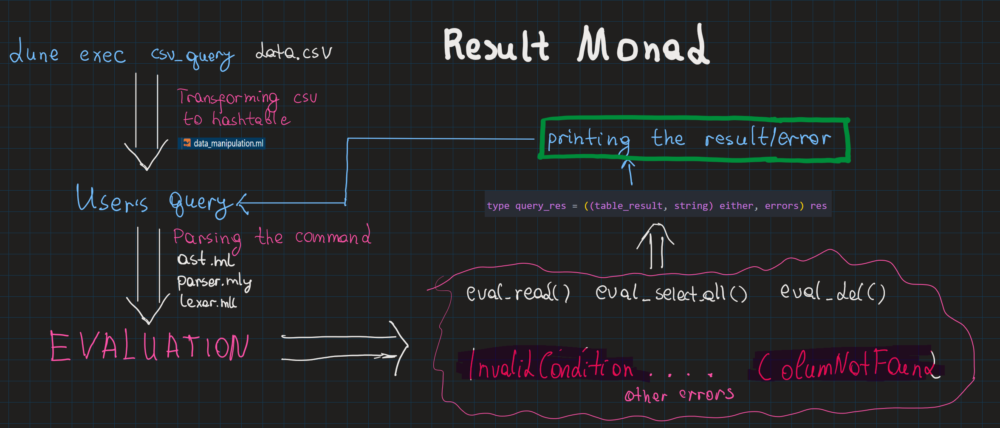

# Mini SQL on CSV using Ocaml

## The outline of the project
* Parser + Lexer for the subset SQL queries
* Basic representation of CSV               
* Error management using monad
* User Interface

## What example commands are implemented so far?
- SELECT * FROM username_file

- READ Username FROM username_file

- READ Username FROM username_file WHERE Identifier > 5000

- DELETE FROM username_file WHERE Identifier = 4081

## How to run
Place your csv file to program/csv_files folder

```
cd program
dune build
dune exec csv_query username_file.csv
```

